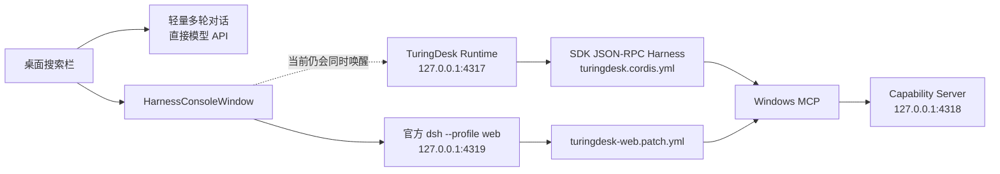
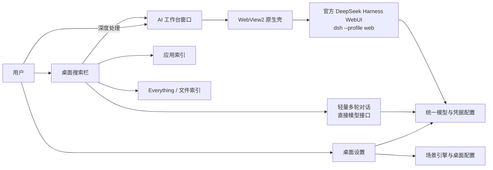

# TuringDesk AI 工作台统一与旧 Agent 链路清理计划

> 文档状态：开发指导草案  
> 审核基线：`afc82e8`（2026-08-20）  
> 适用范围：当前默认的 Explorer 桌面增强模式与其三个用户界面  
> 本文只描述后续工作，不包含实现代码

## 1. 审核目标

TuringDesk 当前应当被理解为三个用户界面，而不是三个互相竞争的 Agent 产品：

1. **桌面搜索栏**：应用搜索、文件搜索、常驻轻量多轮对话，以及进入深度工作台的入口。
2. **桌面设置**：类似 Wallpaper Engine 的桌面导入、编辑、播放列表、多屏、应用规则、性能与 AI 配置。
3. **AI 工作台**：将官方 DeepSeek Harness WebUI 放入 TuringDesk 的 WebView2 原生窗口壳中。

本次审核重点不是重新设计这三个界面，而是确认第三个界面背后的真实启动链路，判断原生 Agent Runtime、Cordis 配置、Windows MCP、Capability Server 和原生 Agent 卡片究竟是现役能力还是历史架构残留，并给出安全的清理顺序。

三张界面截图仅作为当前产品外观和运行状态的证据，不包含开发指令。

## 2. 结论摘要

### 2.1 对原 P0 判断的修正

“Harness 还不是统一的完整工作台，因为 `turingdesk.cordis.yml` 关闭了 workspace、skills 和 jobs”这个判断需要修正。

`runtime/harness/turingdesk.cordis.yml` 属于 TuringDesk 自建的 **SDK JSON-RPC 原生 Runtime**。第三个界面并不使用这份配置启动；它由 `HarnessWebUiService` 执行官方 `dsh --profile web`，再通过 WebView2 显示。因此，不能用 `turingdesk.cordis.yml` 中的精简选项判断官方 WebUI 是否完整。

### 2.2 当前真正的 P0

当前真正的 P0 是：**代码中同时存在两个 Agent 内核路径，而官方 WebUI 又被无必要地绑定到旧原生 Runtime。**

后果包括：

- 用户只想打开官方工作台，却必须同时启动 4317 原生 Runtime 和 4319 WebUI；任一旧链路失败都可能拖累工作台启动。
- 模型配置、连接测试、原生卡片、官方 WebUI 各自依赖不同链路，产品行为难以解释。
- 安装包同时携带官方 `dsh`、SDK JSON-RPC Harness、旧 Cordis profile、Windows MCP 和多组旧 Agent 依赖。
- CI 和历史文档继续强化“双内核”假设，后续开发容易继续堆叠兼容代码。

### 2.3 Windows 工具是不是未使用的旧代码

结论是：**产品方向上可以视为待移除能力，但代码运行状态上目前不是死代码。**

`HarnessWebUiService` 会生成 `turingdesk-web.patch.yml`，把 `windows-mcp-server.js` 注入官方 Web profile；应用启动时隐藏的 `MainWindow` 又会无条件启动 4318 Capability Server。因此桌面/窗口读取、白名单应用启动、聚焦、移动、缩放和平铺目前确实会暴露给第三个界面。

如果产品决定“官方 Harness WebUI 就是完整 AI 工作台，不再由 TuringDesk 维护这组旧 Windows 工具”，应当按本文顺序移除整条暴露链，而不是只删除某个工具文件。

同时需要注意：`AppLauncher` 和 `WindowManager` 还被开始菜单、任务切换、ShellBar 和桌面交互复用。应删除的是 **Agent/MCP 暴露层**，不能把这些共享的 Windows UI 基础服务一起删除。

## 3. 当前完成度的客观评价

| 范围 | 当前状态 | 评价 |
|---|---|---|
| 三个主要界面的产品边界 | 已形成 | 搜索、桌面设置、官方 Harness WebUI 壳的职责基本可辨认 |
| 桌面搜索 1→2→3→4 分层 | 已实现主要路径 | L1 应用、L2 文件、L3 直接模型多轮、L4 打开 Harness 已有明确代码边界 |
| Wallpaper Engine 式设置入口 | 已形成可操作骨架 | 场景、播放列表、多屏、规则、性能、AI 均已有界面和数据路径 |
| 官方 Harness WebUI 集成 | 已接入 | 使用官方 `dsh --profile web`，WebView2 只提供原生窗口壳 |
| AI 工作台统一 | 未完成 | 官方 WebUI 与旧 Runtime 仍被同时启动，存在两套 Agent 生命周期 |
| 工作台功能验收 | 不足 | 当前 smoke test 只证明 Web 服务返回成功，未证明会话、workspace、skills、jobs 和真实工具任务可用 |
| 旧架构清理 | 未开始 | Runtime、SDK profile、原生 Agent 卡片、MCP、Capability、CI、打包和文档仍互相引用 |
| 发布一致性 | 有风险 | 截图中的设置页出现两个“多屏配置”，当前源码只有一个，说明运行包与源码基线可能不一致 |

综合判断：产品原型已跨过“界面演示”阶段，但架构仍处于新旧方案并存期。若以“可长期维护并可发布给普通用户”为标准，当前最主要的工作不是继续扩展功能，而是先完成 AI 工作台单一化和发布链路收口。

## 4. 代码事实与问题清单

### P0-1：工作台错误依赖旧 Runtime

`HarnessConsoleWindow` 打开时先获取 `RuntimeHostService` lease，再启动 `HarnessWebUiService`。页面提示也写成“按需启动 Runtime 与本机 DeepSeek Harness WebUI”。但官方 WebUI 有独立进程、端口、配置和生命周期，并不需要 4317 Runtime 才能显示。

影响：

- 增加启动时间、内存和故障点。
- “刷新”或关闭窗口需要维护两套 idle timeout 和 activity 标记。
- 用户看到工作台启动失败时无法判断是 WebUI、旧 Runtime、MCP 还是 Capability Server 出错。

目标：打开第三个界面时只启动官方 WebUI 及其真正需要的依赖。

### P0-2：旧 Windows MCP 仍注入官方 WebUI

官方 Web profile 启动时始终带 `--patch turingdesk-web.patch.yml`。该 patch 注册 `@deepseek-ai/dsh-mcp-client`，再启动 `windows-mcp-server.js` 访问 4318 Capability Server。

此外，`ResolveRuntimeLayout` 当前把 `windows-mcp-server.js` 的存在作为发现官方 `dsh` 的必要条件。即使只想保留纯官方 WebUI，也会因为缺少旧 MCP 文件而启动失败。

目标：

- 默认工作台不再注入这组旧工具。
- 官方 `dsh` 的可用性检查与 Windows MCP 文件彻底解耦。
- 未来若确实需要 Windows 原生集成，应作为独立、可开关、可授权、可审计的集成重新设计，而不是恢复当前隐式 patch。

### P0-3：缺少“完整工作台”的功能级验收

`harness-web-smoke.ts` 当前只启动 `--profile web` 并轮询首页 HTTP 状态。它不能证明下列能力可用：

- WebUI 能完成首次加载并进入可交互状态。
- 模型和凭据读取正确。
- 新建与恢复多轮会话。
- workspace 打开和切换。
- skills 浏览或使用。
- jobs/后台任务流程。
- 搜索栏带入的深度任务能够稳定进入工作台。
- WebView2 中的资源、下载、弹窗、外部导航和错误恢复正常。

目标：以真实 WebView2 用户路径建立功能验收，而不只检查端口存活。

### P1-1：搜索栏到工作台的任务交接不可靠

当前代码在 WebUI 导航完成后，用一组通用 DOM selector 查找 `textarea`、文本输入框或 `contenteditable` 并填入初始问题。这是 best-effort 注入，依赖上游 DOM 结构，而且不会可靠地自动提交。

目标：优先使用上游支持的 URL、会话或消息接口。若上游没有稳定接口，应把“预填成功但由用户确认提交”明确设计成产品行为，并提供失败回退，不能把 DOM 猜测当作稳定协议。

### P1-2：模型“测试连接”仍依赖待删除 Runtime

保存配置已经会同步官方 Harness store，但“测试连接”仍通过 `RuntimeClient.ConfigureModelAsync` 和 `RuntimeClient.TestModelAsync` 唤醒 4317 Runtime。这是删除旧 Runtime 前必须先迁移的阻塞点。

目标：模型配置保存、凭据存储、轻量对话和官方 WebUI 共用同一份配置；连接测试改为不依赖旧 Agent Runtime 的独立探测流程。

### P1-3：Capability Server 在默认桌面模式常驻

隐藏的 `MainWindow` 在 `Loaded` 时无条件启动 4318 Capability Server，即使用户只使用壁纸、应用搜索或文件搜索，从未打开 AI 工作台。

目标：按当前产品决定删除该 Agent 暴露层。删除前先确认没有外部自动化或兼容承诺依赖 4318。

### P1-4：源码、安装包和文档存在版本漂移

可见证据包括：

- 用户截图中的设置页出现两个“多屏配置”，当前 `DesktopLibraryWindow.xaml` 只有一个。
- `App.xaml.cs` 明确要求 Harness 按需启动，但 `package-portable.ps1` 生成的 BUILD-INFO 仍写着 Harness 在 MainWindow 构造前启动。
- 审计基线中已经移除的旧 Harness/MCP 文档仍描述启动时确保 Harness、原生卡片长期存在等旧架构。

目标：每个测试包显示版本、commit 和构建时间；截图/测试报告必须能追溯到同一 commit；清理后同步 README、架构、路线图、安装说明与 BUILD-INFO。

### P2：隐藏控制窗口承担过多职责

默认增强模式把 `MainWindow` 移到屏幕外并隐藏，但它仍同时拥有语音、Capability Server、旧 Runtime、模型状态、设置入口、搜索入口和旧仪表盘事件。旧用户界面虽然不可见，仍让依赖关系绕回 MainWindow。

目标：后续把默认模式所需的生命周期和导航职责提取为明确的应用控制器。旧 MainWindow 仪表盘在确认无入口后删除，避免继续作为隐形 service locator。

## 5. 目标架构

目标是“一个轻量桌面层 + 一个官方深度工作台”，而不是 TuringDesk 再维护第二套 Agent 内核。

目标架构的硬约束：

1. 只有官方 `dsh --profile web` 是深度 AI 工作台。
2. 搜索栏 L3 保持轻量，不启动官方工作台，也不启动旧 Runtime。
3. 搜索栏 L4 只启动官方工作台，不再获取 4317 Runtime lease。
4. 默认工作台不注入旧 Windows MCP patch。
5. TuringDesk 不再打包或启动 SDK JSON-RPC Agent Runtime。
6. 桌面设置、轻量对话和官方 WebUI 使用同一模型/凭据来源。
7. 增强模式的壁纸、搜索、文件索引不得依赖 Node/Harness 成功启动。

## 6. 保留、迁移与删除清单

### 6.1 明确保留

| 组件 | 原因 |
|---|---|
| `DesktopSearchBarWindow.*` | 当前第一主界面与 1→2→3→4 入口 |
| `DesktopQuickAnswerService.cs` | L3 轻量常驻多轮对话，不依赖旧 Runtime |
| `DesktopSearchIndexService.cs`、应用/Everything 搜索服务 | L1/L2 核心能力 |
| `DesktopLibraryWindow.*`、场景引擎与播放设置 | 当前第二主界面 |
| `HarnessConsoleWindow.*` | 当前第三主界面的原生窗口壳，但需解除旧 Runtime 依赖 |
| `HarnessWebUiService.cs` | 官方 WebUI 进程所有者，但需移除 MCP patch 和 MCP 文件依赖 |
| `HarnessModelBridgeService.cs`、模型与凭据 store | 三个界面之间的配置桥梁 |
| `runtime/src/harness-web-smoke.ts` | 保留并升级为真正的工作台验收起点 |
| `@deepseek-ai/dsh` 与嵌入式 Node | 官方 WebUI 的运行依赖 |

### 6.2 保留但解除旧 Agent 关系

| 组件 | 后续处理 |
|---|---|
| `AppLauncher.cs` | 仍服务开始菜单等原生界面；删除白名单 Agent API 后继续保留通用启动能力 |
| `WindowManager.cs` | 仍服务任务切换、ShellBar 和桌面交互；删除 MCP 暴露不等于删除类本身 |
| `ModelSettingsWindow.*` | 保留设置 UI；迁移连接测试，移除 `RuntimeClient` 构造依赖 |
| `FirstRunSetupWindow.*` | 保留首次设置；移除无实际用途的 `RuntimeClient` 参数 |
| `DesktopLibraryWindow.*` | 保留；移除只为打开模型设置而传递的 `RuntimeClient` |
| `MainWindow` | 短期保留为宿主；逐步提取应用控制器后删除不可见旧仪表盘职责 |

### 6.3 完成迁移后删除

原生 Runtime 链：

- `src/TuringDesk.Desktop/Services/RuntimeClient.cs`
- `src/TuringDesk.Desktop/Services/RuntimeHostService.cs`
- `runtime/src/server.ts`
- `runtime/src/agent-activity.ts`
- `runtime/src/mock-agent.ts`
- `runtime/src/model-gateway.ts`
- `runtime/src/model-config.ts`（确认没有被保留的 WebUI smoke 使用后）
- `runtime/src/harness-gateway.ts`
- `runtime/src/harness-runtime.ts`
- `runtime/src/harness-integration-smoke.ts`
- `runtime/src/openai-compatible-gateway.ts`（确认没有其他入口后）
- `runtime/harness/turingdesk.cordis.yml`

旧 Agent 原生界面链：

- `AgentFloatingCardsService.cs`
- `AgentConversationCardWindow.*`
- `AgentTraceCardWindow.*`
- `AgentActivityWindow.*`
- `AgentStatusBadge.*`
- `MainWindow.AgentEntry.cs` 中的原生 Runtime 提交方法；保留并搬迁工作台导航方法
- 隐藏 MainWindow 中旧 Home/Apps/Workspaces/Tasks/Memory/Agent 仪表盘及其事件
- `DesktopDiyCenterWindow.*`（确认所有设置入口均已统一到 `DesktopLibraryWindow` 后）

Windows Agent 暴露链：

- `src/TuringDesk.Desktop/Services/CapabilityServer.cs`
- `runtime/src/capability-client.ts`
- `runtime/src/windows-mcp-server.ts`
- `runtime/src/windows-mcp-smoke.ts`
- `HarnessWebUiService.WriteTuringDeskWebPatch`
- `TURINGDESK_CAPABILITY_URL`、`TURINGDESK_MCP_NODE`、`TURINGDESK_MCP_SERVER` 环境变量
- CI 中针对 Windows MCP routing metadata 的旧断言

不能随上述清单一起删除的共享代码：

- `AppLauncher.cs`
- `WindowManager.cs`
- `PackagedAppLauncher.cs`
- `TaskSwitcherWindow.*`
- 仍受支持的 replacement-shell 原生窗口管理逻辑

### 6.4 需要产品决策后再动的范围

仓库还支持 `--shell` replacement-shell 模式，`ShellBarWindow`、`AgentStatusBadge` 和部分窗口管理逻辑在该模式下仍有入口。当前三个 UI 描述更接近默认 Explorer 增强模式，因此本计划建议：

- 本轮先把默认增强模式统一为三个界面。
- 明确声明 replacement-shell 是继续支持、冻结还是单独拆分。
- 在决定前不要为了清理 Agent 卡片而破坏 ShellBar 的非 Agent 功能。
- 如果继续支持 shell 模式，应把其中的 Agent 入口改为打开同一个官方工作台，而不是保留旧 Runtime。

## 7. 分阶段开发计划

### 阶段 0：锁定基线与验收样例

工作：

- 为三个界面各建立一份最小手工验收清单和截图基线。
- 测试包界面或诊断信息显示版本、commit、构建时间与架构。
- 记录当前进程、端口、首次启动耗时和内存基线。
- 明确 replacement-shell 是否属于本轮发布范围。

退出条件：截图、二进制和源码 commit 可互相对应；重复“多屏配置”可以被判定为当前源码问题或旧包问题。

### 阶段 1：解除官方 WebUI 与旧 Runtime 的启动耦合

工作：

- `HarnessConsoleWindow` 不再持有 `RuntimeHostService.RuntimeLease`。
- 移除工作台对 4317 的打开、关闭和 activity 通知。
- 加载文案只描述官方 Harness WebUI。
- WebUI 启动失败时显示官方进程 stderr、端口和明确的重试动作。
- 保持搜索栏 L3 完全冷启动契约。

退出条件：从全冷状态打开第三个界面时，只出现官方 WebUI 进程/4319，不出现 4317 Runtime；关闭后 idle 回收正常。

### 阶段 2：迁移模型配置与深度任务交接

工作：

- 把模型连接测试从 `RuntimeClient` 迁移为独立探测。
- 移除设置窗口和首次设置对 `RuntimeClient` 的参数传递。
- 验证轻量对话与官方 WebUI 读取同一模型、Base URL 和凭据。
- 为搜索栏深度处理建立稳定交接协议；不能依赖未受支持的 DOM selector 作为唯一方案。
- 明确多轮上下文是否只带当前问题、摘要，还是创建/复用 Harness 会话。

退出条件：删除 4317 Runtime 后，模型保存、测试、L3 对话、L4 工作台均可独立工作；深度问题不会静默丢失。

### 阶段 3：移除 Windows MCP 与 Capability Server 暴露链

工作：

- 停止生成和传入 `turingdesk-web.patch.yml`。
- 让官方 `dsh` 路径发现不再要求 `windows-mcp-server.js` 存在。
- 删除 4318 Capability Server 的默认启动与生命周期。
- 删除 MCP server/client、smoke、环境变量和相关依赖。
- 保留仍被桌面原生 UI 使用的 `AppLauncher`、`WindowManager`。
- 做一次仓库级引用检查，确保不存在静默残留入口。

退出条件：打开工作台时没有 `turingdesk` MCP server，没有 4318 监听端口；应用搜索、开始菜单、任务切换和桌面最小化等原生功能不回归。

### 阶段 4：删除原生 SDK Runtime 与旧 Agent UI

工作：

- 删除 `RuntimeClient`、`RuntimeHostService` 和 4317 Node server。
- 删除 SDK JSON-RPC Harness gateway、Cordis profile 和 integration smoke。
- 删除原生 Conversation/Trace/Activity 卡片及旧 Runtime 状态 UI。
- 将“深度处理”“外部命令”和 shell 模式 Agent 入口统一导航到官方工作台。
- 提取默认模式所需的应用控制器和导航服务，减少隐藏 MainWindow 职责。

退出条件：仓库中不存在 4317、`turingdesk.cordis.yml`、SDK JSON-RPC Agent 或原生 Agent 卡片的运行入口；三个主界面仍可完成各自职责。

### 阶段 5：收缩依赖、打包、CI 与文档

工作：

- `runtime/package.json` 只保留官方 WebUI 和实际 smoke 所需依赖。
- 移除 SDK server、agent spine、旧 session/compaction/token/MCP 等只服务旧 profile 的依赖。
- 打包脚本不再复制旧 profile，不再运行 integration/MCP smoke，也不再把它们列为必需文件。
- 保留并强化官方 WebUI final-layout 测试。
- 删除或改写 `scripts/Start-TuringDesk.ps1` 中旧 `server.js` 入口。
- 更新 README、ARCHITECTURE、HARNESS-MCP、ROADMAP、SHELL 文档和 BUILD-INFO。
- 对 win-x64 与 win-arm64 分别验证安装、升级、卸载与冷启动。

退出条件：发布包只包含一个 Harness 工作台实现；CI 不再保护旧双内核契约；安装包说明与实际运行拓扑一致。

## 8. 三个界面的验收标准

### 8.1 桌面搜索栏

- 应用搜索可发现并启动 Win32 与已支持的打包应用。
- 文件搜索在 Everything 可用和不可用时都有明确状态。
- L3 多轮对话不启动 Node、4317 或 4319。
- 模型不可用、超时和取消不会自动误升级为深度任务。
- 用户主动点击“深度处理”或使用约定快捷键才打开工作台。
- 深度问题可以被可靠带入工作台，失败时明确提示并保留原文。

### 8.2 桌面设置

- 已安装、播放列表、多屏、应用规则、性能、AI 各只有一个明确入口。
- 导入图片、视频、HTML、`.tdscene` 后可预览、应用和再次打开。
- 场景应用、重启恢复、多屏、全屏暂停/释放规则可验证。
- 模型保存和测试不依赖旧 Runtime。
- 设置窗口关闭后桌面状态保持，不产生隐藏的旧设置窗口。
- 构建版本与截图一致，不再出现重复 tab 等旧包现象。

### 8.3 AI 工作台

- 冷启动只启动官方 `dsh --profile web`。
- 首屏、会话创建、多轮回复、历史恢复正常。
- workspace、skills、jobs 按官方 Web profile 的真实能力逐项验收；如果上游版本不提供某项，产品文案必须如实说明，不能用 TuringDesk 旧 profile 的配置推断。
- 模型与凭据和设置页一致，且不会把密钥显示在日志或进程参数中。
- 关闭、重开、刷新、网络中断、上游进程退出和端口冲突都有可恢复状态。
- 默认不出现 `turingdesk` Windows MCP 工具。
- WebView2 外部导航、下载、弹窗和权限请求有明确安全策略。

## 9. 测试矩阵

| 类型 | 最低覆盖 |
|---|---|
| 静态架构检查 | L3 不引用 Runtime/Harness；工作台不引用 RuntimeHost；仓库无 4317/旧 profile 入口；默认无 MCP patch |
| 单元测试 | 搜索分层、模型选择、配置迁移、深度交接数据、进程生命周期状态机 |
| 组件测试 | 官方 WebUI final-layout 启动、模型 store 同步、WebView 导航与错误页 |
| UI 自动化 | 打开三个界面、搜索应用/文件、L3 多轮、L4 交接、设置并应用场景 |
| 故障注入 | 无 API Key、错误模型、断网、4319 被占用、WebUI 崩溃、WebView2 缺失、安装路径含空格/中文 |
| 发布验证 | win-x64、win-arm64；首次安装、覆盖升级、卸载；Explorer 增强模式；若继续支持则另测 `--shell` |

特别要求：不能继续把“HTTP 200”当作 AI 工作台完成的唯一标准。至少需要一个无真实费用的交互态测试，以及一个受控凭据环境中的真实多轮 E2E。

## 10. 风险与回滚策略

1. **上游 Web profile 能力与预期不一致**：先在锁定的 `@deepseek-ai/dsh` 版本上完成 workspace/skills/jobs 能力盘点，再删除旧 Runtime；不要从 package 名称或 UI 标签推断。
2. **模型测试迁移后行为变化**：连接测试只验证提供商连接，不应创建长期 Harness 会话；保留明确错误分类。
3. **shell 模式回归**：把 enhancement 与 replacement-shell 验收分开。若 shell 模式未纳入当前发布，明确标为实验/冻结，而不是默默保留一半旧 Agent。
4. **安装包升级残留旧文件**：升级测试必须检查旧 `server.js`、Cordis profile 和 MCP 文件是否被 MSI 正确移除。
5. **深度问题交接受上游 UI 改版影响**：任何 DOM 注入都必须有版本化测试和可见回退；优先推动/使用稳定接口。

每个阶段应独立提交并可回滚。不要在一个变更中同时删除 Runtime、模型测试、MCP、旧 UI 和打包逻辑。

## 11. 完成定义

只有同时满足以下条件，才能宣布“DeepSeek Harness 已成为 TuringDesk 统一完整 AI 工作台”：

- 用户侧仍只有搜索栏、桌面设置和 AI 工作台三个主要界面。
- 深度工作只有一个内核：官方 `dsh --profile web`。
- `turingdesk.cordis.yml`、4317 Runtime、原生 Agent 卡片和旧 SDK gateway 已移除。
- 默认 WebUI 不再加载旧 Windows MCP，4318 Capability Server 不再常驻。
- L1/L2/L3 不因 Harness 不可用而失效。
- 模型配置、凭据和连接测试不依赖被删除的 Runtime。
- workspace、skills、jobs 等能力有基于官方 Web profile 的实际测试结论。
- win-x64/win-arm64 安装包、CI、README、架构文档和运行行为一致。
- 每个发布截图和测试报告都可追溯到明确 commit，不再出现源码与安装包 UI 不一致。

## 12. 建议的首批开发任务

按风险和依赖顺序，下一轮只安排以下五项：

1. 给当前测试包增加 commit/build 信息并复现设置页重复“多屏配置”。
2. 为官方 WebUI 建立功能盘点：会话、workspace、skills、jobs、模型 store、错误恢复。
3. 解除 `HarnessConsoleWindow` 对 `RuntimeHostService` 的依赖，并验证只启动 4319。
4. 把模型“测试连接”迁出 `RuntimeClient`。
5. 在以上两项通过后，移除 WebUI 的 Windows MCP patch 与默认 4318 Capability Server。

完成这五项后，再进入原生 Runtime、旧 Agent UI、依赖和打包文件的批量删除阶段。
