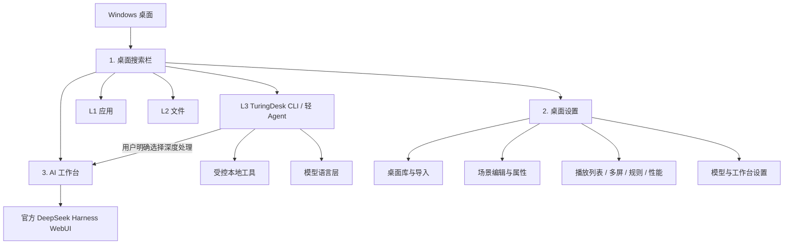
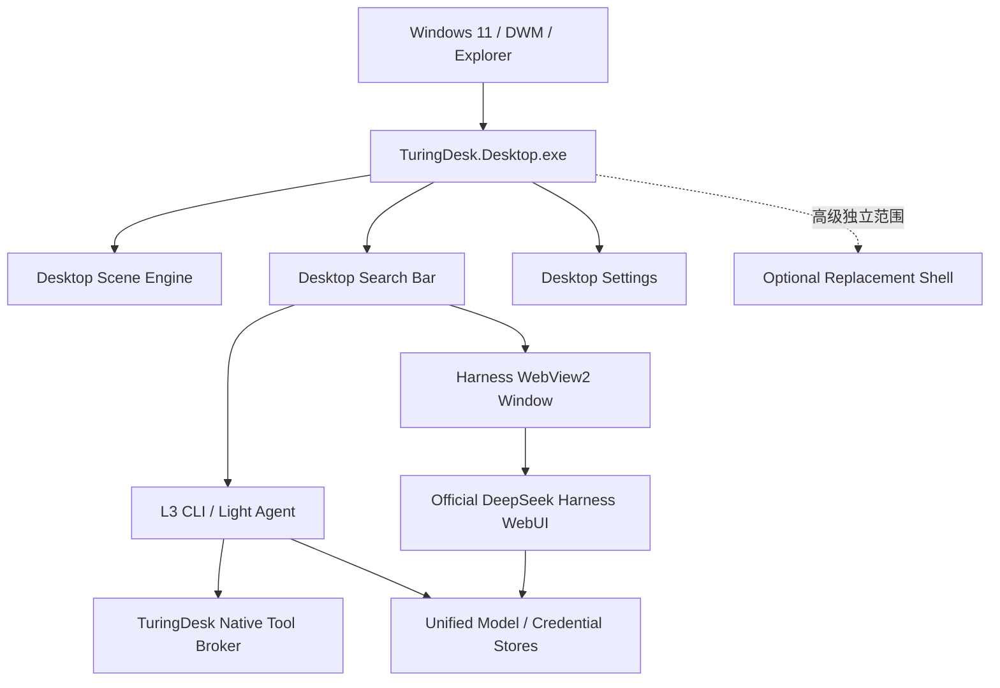

# TuringDesk 产品与系统设计规范

> 状态：**已确认设计基线**  
> 版本：0.3  
> 日期：2026-08-21  
> 变更基线：`7a977ae`  
> 适用对象：产品、设计、桌面端、Runtime、测试、打包与文档维护者

## 1. 文档目的

本文定义 TuringDesk 的长期产品方向、用户界面、功能边界和系统架构，是后续开发的统一设计基线。

它解决的问题不是“下一次提交改什么”，而是：

- TuringDesk 最终是什么产品；
- 用户应该看到哪些界面；
- 搜索、本地 CLI / 轻 Agent 和深度工作台如何分工；
- 哪些能力属于 TuringDesk，哪些能力交给 DeepSeek Harness；
- 哪些旧路线不得重新进入默认产品；
- 功能完成应当按照什么标准判断。

本文为当前产品与系统设计的唯一基线。旧 Home、旧 Agent Runtime、旧 Windows MCP、旧 Cordis profile 和历史多套 AI 前端不得恢复为并行设计依据。

执行计划可以安排实现顺序，但不能改变本文定义的产品边界。

## 2. 规范语言

- **必须**：发布前不可省略的产品或架构约束。
- **应该**：正常情况下应遵守，偏离时必须记录理由和影响。
- **可以**：允许实现，但不能破坏“必须”和“应该”项。
- **非目标**：当前产品明确不做；不得以临时兼容为理由恢复。

## 3. 产品定义

TuringDesk 是运行在 Windows 上的 **可编程桌面引擎 + 分层 AI 桌面入口**。

它包含两个同等重要的支柱：

1. **Wallpaper Engine 级桌面体验**：桌面场景播放、导入、编辑、属性、多屏、播放列表、应用规则与性能控制。
2. **四层 AI 工作流**：L1 应用、L2 文件、L3 TuringDesk 原生受控 CLI / 轻 Agent、L4 官方 DeepSeek Harness 深度工作台。

一句话描述：

> TuringDesk 在保留 Windows 原生桌面兼容性的前提下，把 Wallpaper Engine 式桌面定制、统一搜索、常驻轻量本地 Agent 与完整 Harness 工作台组合成一个桌面产品。

## 4. 核心设计原则

### 4.1 保留 Windows，增强桌面

默认模式必须保留 Explorer。Explorer 继续负责：

- 桌面图标；
- 开始菜单与任务栏；
- 系统托盘；
- 文件右键菜单、Jump List 和 Shell 兼容性；
- 普通 Windows 应用窗口管理。

TuringDesk 默认只负责 Explorer 没有提供的能力：

- 动态桌面场景；
- 桌面场景编辑和自动切换；
- 顶部统一搜索；
- L3 本地 CLI / 轻 Agent；
- 官方 DeepSeek Harness 工作台入口。

Replacement Shell 不是默认产品路径，不得影响默认增强模式的设计和发布节奏。

### 4.2 三个主界面

默认产品只允许三个一级用户界面：

1. **桌面搜索栏**；
2. **桌面设置**；
3. **AI 工作台**。

普通用户不应再看到旧 Home 仪表盘、Workspace/Tasks/Memory 页面、AI Orb、Conversation Card、Execution Trace Card 或独立 Runtime 控制面板。

### 4.3 一个深度工作台

官方 DeepSeek Harness WebUI 是唯一的深度 AI 工作台。

TuringDesk 必须复用官方 WebUI，不重新开发第二套完整 Agent 前端，也不维护第二个原生重型 Agent 内核。

### 4.4 四层轻重分离

固定路线：

```text
L1 应用搜索
  -> L2 文件搜索
    -> L3 TuringDesk 原生受控 CLI / 轻 Agent
      -> L4 官方 DeepSeek Harness
```

L1/L2/L3 必须保持快速、常驻、低资源，并且不依赖 Harness 成功启动。

L3 **不是“换个名字的普通聊天框”**。模型只是 L3 的语言理解和生成层之一，L3 的产品核心是 TuringDesk 自己拥有、自己约束、自己测试的本地能力层。

L4 才负责 workspace、skills、jobs、复杂多步骤自主执行和大上下文深度工作。

### 4.5 用户控制优先

TuringDesk 不应在用户只想搜索、问答或执行低风险本地动作时自动打开大型工作台。

- L3 的本地动作必须来自用户明确意图或明确确认；
- 高风险、破坏性、管理员级或任意 shell 行为不得在 L3 静默执行；
- 升级 L4 必须可见、可撤销、由用户确认；
- 网络错误、模型错误或超时不是自动升级 L4 的理由。

### 4.6 失败隔离

- 桌面场景失败不能破坏 Explorer。
- AI 模型失败不能破坏 L1/L2 和 L3 已支持的本地工具。
- Harness 失败不能破坏桌面设置或 L1/L2/L3。
- WebView2 失败不能让用户失去 Windows 桌面。
- 场景渲染暂停或释放时，搜索栏仍应可用。

### 4.7 一级窗口互不阻塞

搜索栏、桌面设置、AI 工作台在产品层面彼此独立：

- AI 工作台不得以 modal/Owner 关系阻塞桌面设置；
- 桌面设置不得阻塞已打开的 AI 工作台；
- 工作台启动失败或加载中不得抢占设置窗口的输入；
- 除首次设置向导等明确流程外，三个一级界面不得通过 `ShowDialog()` 互相绑定生命周期。

## 5. 用户界面信息架构



## 6. 界面一：桌面搜索栏

### 6.1 定位

桌面搜索栏是 TuringDesk 的第一入口，也是应用、文件、L3 本地能力和 L4 深度工作台的统一路由器。

它不是任务栏，不替代 Windows 开始菜单，也不是缩小版 Harness。

### 6.2 布局与窗口层级

搜索栏必须位于主显示器顶部居中区域，并处于桌面 Z-order：

- 高于 Explorer 桌面背景和图标层；
- 低于所有普通应用窗口；
- 不能使用全局 always-on-top；
- `Alt+Space` 聚焦后仍应返回桌面层级；
- 桌面图标 best-effort 避让搜索栏保留区，失败时不得隐藏或替换 Explorer。

从左到右固定信息结构：

1. AI 标识和当前 L3 模型选择器；
2. 主搜索/CLI 输入框；
3. 语音入口；
4. 设置入口。

### 6.3 L1：应用

目标：快速查找并启动本机应用。

必须支持：

- Win32 应用；
- 已支持的打包应用；
- 模糊匹配、拼音/名称等现有搜索能力；
- 键盘上下选择和 Enter 启动；
- 使用真实 Windows 应用图标。

应用发现和启动由 TuringDesk 原生服务完成，不通过 Harness。

### 6.4 L2：文件

目标：快速查找并打开本机文件或文件夹。

必须支持：

- Everything 可用时的快速结果；
- Everything 未连接、正在索引和发生错误时的明确状态；
- 使用 Windows 默认关联方式打开结果；
- 不把文件内容自动发送给模型；
- 文件内容读取必须由用户明确请求，并受 L3/L4 权限边界约束。

### 6.5 L3：TuringDesk 原生受控 CLI / 轻 Agent

#### 6.5.1 定位

L3 是 TuringDesk 常驻本地能力层，目标效果逐步接近普通 CLI 的高频实用能力，但必须通过 TuringDesk 自己的框架、工具注册表、权限边界和 UI 反馈完成。

L3 由两部分组成：

1. **本地工具控制器**：确定性地执行 TuringDesk 已注册的低风险本地能力；
2. **模型语言层**：完成问答、写作、解释、翻译、代码建议和自然语言理解。

模型不是 L3 本身，也不得绕过工具控制器直接获得 Windows 权限。

#### 6.5.2 L3 必须具备的性质

- 常驻于 TuringDesk 进程，不启动 Node；
- 不启动旧 4317 Runtime；
- 不依赖 Harness WebUI；
- 工具能力由 TuringDesk 原生代码注册和测试；
- 能在模型不可用时继续执行不依赖模型的本地工具；
- 工具调用结果在搜索栏自己的交互层显示；
- 普通聊天保留有限多轮上下文；
- 本地工具失败不能自动升级 L4。

#### 6.5.3 首批允许的低风险本地工具

首个 L3 CLI 能力批次至少包括：

- 本机时间/日期查询；
- 网络、电源/电池等只读系统状态；
- 已安装应用搜索；
- Everything 文件/文件夹搜索；
- 用户明确要求且匹配足够确定时启动已发现应用；
- 用户明确要求且唯一精确匹配时使用 Windows 默认关联打开文件。

推荐同时提供明确 CLI 命令和自然语言别名，例如：

```text
/help
/status
/time
/apps <关键词>
/files <关键词>
/open <应用名>
/open-file <文件名>
```

以及：

```text
打开记事本
搜索文件 预算
查看系统状态
```

#### 6.5.4 L3 继续扩展的目标

后续可以在同一受控框架中加入：

- 明确范围的文本文件读取/摘要；
- 已知目录浏览；
- 剪贴板与选中文本能力；
- 应用状态查询；
- 受限的文件创建/移动等需要确认的动作；
- 可审计的工具组合；
- 模型驱动的结构化 tool calling。

新增工具必须先定义参数、权限级别、用户确认规则、结果格式、取消和失败行为，不允许直接把模型接到裸 PowerShell/Bash。

#### 6.5.5 L3 明确禁止

默认 L3 不执行：

- 任意 PowerShell、CMD、Bash；
- 任意未注册可执行文件/参数拼接；
- 静默删除或覆盖文件；
- 安装/卸载软件；
- 关机、重启、注册表修改；
- 管理员提权；
- 不受范围约束的屏幕、窗口或本地数据采集；
- 长时间复杂自主循环。

这些请求应说明边界，并由用户显式选择是否进入 L4；即便进入 L4，也必须遵守 Harness 自身的确认与安全策略。

### 6.6 L4：Harness 深度处理

目标：把需要 workspace、skills、jobs、复杂工具执行、大上下文或多步骤自主流程的请求交给完整 AI 工作台。

进入方式必须显式，例如：

- 用户点击“深度处理”；
- 用户使用约定的深度处理快捷键；
- 用户接受 L3 给出的升级建议。

进入 L4 时必须保留原始问题。交接失败时保留可复制文本并允许重试，不能静默丢弃请求。

### 6.7 Enter 与深度处理规则

- 有选中的应用或文件结果时，Enter 执行该结果。
- 没有选中结果时，Enter 进入 L3。
- Ctrl+Enter 或独立“深度处理”操作进入 L4。
- L3 本地工具命令不应因为模型未配置而失效。
- 网络错误、模型错误和超时不自动进入 L4。

### 6.8 语音

语音是搜索栏输入方式，不是第四个主界面。

语音识别结果必须可见，并进入与键盘输入相同的 L1→L2→L3→L4 路由。语音不得绕过 L3 工具确认或 L4 显式确认边界。

## 7. 界面二：桌面设置

### 7.1 定位

桌面设置是 Wallpaper Engine 式桌面管理中心，也是唯一的 TuringDesk 设置入口。

设置按钮不得同时打开多个历史设置窗口。旧 Desktop DIY Center、旧 MainWindow 设置页和分散模型弹窗必须逐步合并到同一设置体系。

### 7.2 固定一级栏目

一级栏目顺序：

1. **已安装**：桌面库、搜索、预览、应用、导入和导出；
2. **播放列表**：顺序/随机轮换与时间设置；
3. **多屏配置**：每屏、跨屏、镜像和配置快照；
4. **应用规则**：根据程序运行、聚焦或全屏切换场景和播放状态；
5. **性能**：FPS、音量、电源、全屏和资源释放策略；
6. **AI**：模型、Base URL、凭据、连接测试、L3 工具权限和 AI 工作台入口；
7. **高级/诊断**：版本、commit、日志、WebView/Harness 状态和实验功能。

同一个栏目不得重复出现。

### 7.3 桌面项目类型

桌面库目标支持：

- 图片；
- 动图；
- 视频；
- Web（HTML/CSS/JS）；
- Scene（图层、效果、粒子、时间轴、音频响应、视差、Shader 和脚本）。

项目使用可版本化场景/包格式。公开场景模型不得与 WPF 强绑定。

### 7.4 编辑体验

用户从“已安装”的桌面项目进入编辑，而不是进入独立产品首页。

完整编辑目标包括图层树、变换、混合、媒体/文字/Widget/粒子、时间轴、视差、音频响应、效果/Shader、脚本钩子、性能信息、导入导出。

首个对外版本采用 **效果优先的 Creator Lite**：必须稳定应用至少 3 个展示品质的内置场景；编辑器首版只承诺基础图层、变换、简单粒子/效果和双关键帧循环动画。完整 Shader 编辑器、节点图和专业多轨时间轴不进入首版门槛。

### 7.5 用户属性

每个场景可以声明普通用户属性：颜色、滑块、开关、下拉、文本、媒体/纹理替换、快捷动作和属性分组。

属性面板必须根据元数据生成，不能为每个场景硬编码页面。

### 7.6 多屏与播放规则

目标支持：

- 每屏不同场景；
- 跨屏；
- 克隆/镜像；
- 每屏独立播放列表；
- 保存/恢复显示器配置；
- 显示器插拔和 DPI 变化后安全恢复；
- 应用启动、聚焦、最大化或全屏时执行 keep、mute、pause、stop 或场景切换。

## 8. 界面三：AI 工作台

### 8.1 定位

AI 工作台是官方 DeepSeek Harness WebUI 的 TuringDesk 原生窗口壳。

TuringDesk 负责：

- 启动/停止官方 Web profile；
- WebView2 原生窗口承载；
- 加载、错误、重试和进程崩溃状态；
- 模型与凭据统一配置桥接；
- L3 到工作台的任务交接；
- 本地 URL 和窗口安全策略。

DeepSeek Harness 负责：

- 完整会话 UI；
- workspace；
- skills；
- jobs/后台任务；
- Harness 自身工具、状态和高级设置；
- 会话持久化与官方交互行为。

### 8.2 唯一内核约束

深度工作台只有一个进程路径：

```text
TuringDesk AI Workbench Window
  -> WebView2
    -> official dsh --profile web
```

不得并行启动：

- TuringDesk 4317 Agent Runtime；
- SDK JSON-RPC Harness；
- 原生 Agent cards/runtime 状态投影；
- 只为兼容旧链路存在的 Cordis profile。

L3 的 TuringDesk 原生工具层不是第二个“重型 Agent Runtime”；它必须保持小型、白名单化、与当前桌面进程同生命周期。

### 8.3 启动与关闭

- TuringDesk 启动时不预热 Harness。
- 用户进入 L4 或从设置打开工作台时按需启动。
- 工作台存在活动窗口或任务时不得被 idle timer 误杀。
- 所有工作台窗口关闭且无活动任务后，可以延迟回收进程。
- 当前无法可靠判断 Harness 后台任务是否空闲时，允许保守地保持自有进程到 TuringDesk 退出，但必须记录为临时实现差异。
- 刷新只刷新 WebUI，不启动另一个 Agent Runtime。
- 端口冲突、进程退出、启动超时和 WebView2 缺失必须有可理解错误页。

### 8.4 任务交接

L3 提交给工作台的最小数据包括：

- 原始用户文本；
- 用户明确选择的工作区（如有）；
- 可选的 L3 对话摘要，但不得未经用户预期传递全部历史；
- 来源标记和创建时间。

优先使用 Harness 官方 URL、会话或消息接口。DOM selector 注入只能作为有版本测试的兼容回退，不能成为唯一协议。

### 8.5 Windows 工具边界

默认工作台不注入旧 TuringDesk Windows MCP，不启动 4318 Capability Server。

L3 原生工具与旧 Windows MCP 是两个不同概念：

- L3 工具由 TuringDesk 自己的 API/服务直接实现；
- 每个工具有明确参数和权限；
- 不开本地 capability HTTP server；
- 不把整套 WindowManager/桌面控制面暴露给模型；
- 不恢复历史隐式 MCP patch。

未来增加 Windows 自动化必须满足用户可见开关、最小权限、范围约束、确认、审计、失败与撤销策略。

## 9. 统一模型与凭据设计

### 9.1 一个设置概念

用户只设置一次提供商、模型、Base URL 和凭据。L3 模型语言层与官方 Harness 工作台读取同一个逻辑配置。

L3 的本地工具不应因为模型未配置而失效。

### 9.2 数据职责

- 非敏感模型设置可以保存在 TuringDesk 设置中，并同步到官方 Harness settings store。
- API Key 必须写入官方 Harness 可写 credential store；Windows Credential Manager 可以作为迁移或恢复副本。
- 不得把 API Key 放入命令行参数。
- 不得通过继承环境变量把只读凭据覆盖到官方 WebUI。
- 日志、错误页、诊断页和崩溃报告不得显示完整密钥。

### 9.3 连接测试

连接测试是独立提供商探测，不启动旧 Agent Runtime，也不创建持久 Harness 会话。

至少区分凭据错误、Base URL 无法连接、模型不存在、限流、超时和返回格式不兼容。

## 10. 目标系统架构



### 10.1 常驻部分

默认启动后可以常驻：

- Explorer 桌面场景宿主；
- 搜索索引和搜索栏；
- 场景播放规则；
- 可选语音识别；
- L3 本地工具注册表/控制器；
- 轻量模型配置和有限对话状态。

### 10.2 按需部分

只有用户进入 L4 时启动：

- 嵌入式 Node；
- 官方 `dsh --profile web`；
- WebView2 工作台内容进程。

### 10.3 不再存在的默认部分

- 4317 TuringDesk Agent Runtime；
- 4318 Capability Server；
- TuringDesk SDK JSON-RPC Harness；
- TuringDesk-owned Agent Cordis profile；
- 原生 Conversation/Trace/Activity cards；
- 默认注入的 Windows MCP。

## 11. 数据与状态边界

### 11.1 TuringDesk 拥有

- 场景库索引和场景包；
- 当前桌面与每屏分配；
- 播放列表；
- 应用规则和性能设置；
- 搜索设置；
- L3 有限会话状态；
- L3 工具注册/权限/确认状态；
- 非敏感模型配置；
- UI 布局与首次使用状态。

### 11.2 Harness 拥有

- Harness 会话历史；
- workspace 状态；
- skills/jobs 等官方工作台数据；
- 官方 Harness credential store；
- 官方 WebUI 自身设置。

TuringDesk 不复制或私自修改 Harness 内部会话格式。

### 11.3 场景包

场景包必须有格式版本、迁移策略、路径约束、脚本/Web 权限策略；导入失败不得污染已安装库。

## 12. 视觉与交互设计

### 12.1 总体风格

目标是“Windows 11 熟悉感 + 轻量桌面增强”，不是全屏 AI 仪表盘。

- 系统字体和清晰 Windows 窗口行为；
- 默认浅色中性背景、蓝色主操作色和适度圆角；
- 状态可区分；
- 支持 100%～200% DPI 和多屏不同缩放；
- 键盘导航、焦点和文本选择可用。

### 12.2 搜索栏

- 是稳定完整的桌面控件；
- 模型选择器不抢占主输入区域；
- 搜索和 CLI 结果按需展开；
- 本地工具执行结果必须明确标识“已执行”“未执行”“需要确认/深度处理”；
- 普通应用覆盖搜索栏时不得穿透或抢焦点。

### 12.3 设置页

- 原生可缩放窗口；
- 桌面库卡片浏览；
- 编辑功能层级清晰；
- 禁用操作说明原因；
- 区分“立即生效”“保存”“应用到桌面”；
- AI 设置最终收口到此，不长期保留独立模型设置弹窗。

### 12.4 工作台

- 原生壳只提供标题、加载/错误、刷新和必要诊断；
- 不重复实现 Harness 导航、会话栏或工具 UI；
- 加载页明确写“官方 AI 工作台”，不用“Runtime”；
- 超时后提供错误详情和重试；
- 窗口不得阻塞桌面设置。

## 13. 性能与可靠性要求

### 13.1 启动

- 搜索栏和静态桌面不等待 AI 或 Node。
- Harness 不在应用启动时预热。
- L3 本地工具控制器不得引入 Node/HTTP Agent server。
- 场景加载失败时回退 Windows 原桌面或安全静态场景。

### 13.2 搜索与 L3

- 热索引下应用结果接近即时反馈。
- 文件提供商较慢时先显示状态，不阻塞应用结果。
- 用户连续输入时取消过期查询和模型请求。
- 本地工具优先于模型执行，能确定完成的请求不应浪费模型调用。
- 模型不可用时 `/status`、`/time`、应用/文件本地工具仍可用。

### 13.3 场景

支持 FPS 限制、全屏 keep/pause/stop；stop 必须释放重型资源；多屏变化不得覆盖普通应用；渲染故障不能终止搜索栏或设置进程。

### 13.4 工作台

- 只绑定 loopback；
- 结束自己拥有的进程，不结束用户自行启动的 Harness；
- 端口占用和僵尸进程有诊断；
- HTTP 200 只能证明服务存活，不等于工作台功能完成。

## 14. 安全与隐私

- 默认增强模式不修改 Windows Shell 注册表。
- Replacement Shell 只能用户显式启用并提供恢复入口。
- TuringDesk 不默认获得管理员权限。
- L3 必须通过注册工具执行本机操作，禁止把模型输出直接拼接成 shell 命令。
- 首批 L3 只允许只读查询和用户明确要求的低风险打开动作。
- 文件读取、写入、移动、删除等后续工具必须单独设计权限和确认，不因“CLI”名称自动获得授权。
- 默认官方工作台不注入旧 TuringDesk Windows MCP。
- WebView 只允许预期本地工作台来源；外部导航交给系统浏览器或阻止。
- Web/脚本场景和导入包视为不受信任内容。
- 用户数据和凭据不进入普通日志。

## 15. 降级体验

| 故障 | 必须保留的能力 | 用户反馈 |
|---|---|---|
| Everything 不可用 | 应用搜索、L3 非文件工具、设置、工作台入口 | 显示文件搜索未连接及恢复建议 |
| 模型/API 不可用 | L1/L2、L3 本地工具、桌面设置 | L3 语言请求提示配置模型，本地命令继续可用 |
| Harness 启动失败 | 桌面、L1/L2/L3、设置 | 工作台错误页、日志摘要、重试 |
| WebView2 不可用 | 桌面、搜索、L3、设置 | 提示安装/修复 WebView2 |
| 场景渲染失败 | Explorer、搜索、设置、AI | 回退安全桌面并标记失败场景 |
| 多屏拓扑改变 | Explorer 和普通应用 | 重建场景宿主，不覆盖应用窗口 |

## 16. 非目标

默认产品不做：

- 替换 Windows 内核；
- 默认替换 Explorer；
- 全屏聊天应用；
- 常驻宽侧栏/三栏 AI 仪表盘；
- 旧 MainWindow Home/Apps/Workspace/Tasks/Memory；
- AI Orb 作为主要入口；
- TuringDesk 自研完整 Harness 前端；
- 第二套重型原生 Agent Runtime；
- 原生 Conversation/Execution Trace 卡片；
- 默认 Windows MCP/Capability Server；
- 旧 Chrome/VS Code/Terminal 三项白名单 Agent 工具路线；
- 默认无限制终端、文件或管理员自动化；
- 把 CI/安装包成功当作用户功能完成。

注意：**“不做旧白名单 Agent 工具”不等于 L3 不能启动应用。** L3 应复用真实应用索引，以统一、明确、低风险方式打开用户指定应用，而不是恢复旧 Runtime 工具链。

## 17. Replacement Shell 的产品位置

Replacement Shell 是高级、显式、独立验收模式，不属于三个主界面的默认路线。

- 可以保留现有 `--shell` 和恢复机制；
- 不得让 shell 专用需求改变默认增强模式架构；
- 不得为 shell 模式保留第二套 Agent 内核；
- shell 需要深度 AI 时打开同一个官方工作台。

## 18. 关键用户旅程

### 18.1 应用搜索

1. 用户点击搜索栏或按 `Alt+Space`。
2. 输入应用名称。
3. 结果即时显示真实图标和名称。
4. 用户选择 Enter。
5. Windows 原生应用启动，搜索栏回到桌面层。

### 18.2 文件搜索

1. 用户输入文件名/路径关键词。
2. 应用和文件结果清晰区分。
3. 用户选择文件/文件夹。
4. 使用 Windows 默认关联打开。

### 18.3 L3 本地 CLI / 轻 Agent

1. 用户输入 `/status` 或“查看系统状态”。
2. TuringDesk 本地工具控制器直接读取系统状态，不调用模型/Harness。
3. 用户输入 `/files 预算`，L3 复用 Everything 返回本地候选。
4. 用户输入“打开记事本”，L3 从真实应用索引中确定匹配并执行。
5. 用户输入普通解释/写作问题时，L3 使用当前模型语言层回答并保留有限上下文。
6. 用户输入高风险/复杂请求时，L3 不执行，提供明确“深度处理”选择。

### 18.4 深度任务

1. 用户提出需要工作区、skills、jobs、复杂执行或任意命令的请求。
2. 用户明确选择“深度处理”。
3. TuringDesk 打开工作台加载页，并按需启动官方 Harness WebUI。
4. 原始请求可靠进入工作台。
5. 用户在官方 WebUI 中管理执行过程。

### 18.5 应用桌面

1. 用户从搜索栏打开设置。
2. 在“已安装”中选择场景或导入项目。
3. 预览并查看属性。
4. 点击“应用到桌面”。
5. 场景在 Explorer 图标后生效并可恢复。

### 18.6 编辑桌面

1. 用户在已安装项目中选择编辑。
2. 编辑图层、属性、效果或时间轴。
3. 实时预览。
4. 保存版本化项目。
5. 应用到一个或多个显示器。

## 19. 发布验收门槛

### 19.1 产品结构

- 默认只出现三个主界面。
- 旧 Home、Orb、原生 Agent 卡片和 Runtime UI 无普通入口。
- 设置只有一个入口和一套栏目。
- AI 工作台与桌面设置互不模态阻塞。

### 19.2 搜索与 L3

- L1/L2/L3/L4 路由符合本文规则。
- L3 不启动 Node/Harness。
- L3 至少实测 `/status`、`/time`、`/apps`、`/files`、`/open`、`/open-file`。
- 模型未配置时，本地 L3 工具仍可运行。
- L3 不执行任意 shell 或高风险系统动作。
- L4 只启动官方 WebUI。
- 任一路径故障不拖垮其他路径。

### 19.3 桌面引擎

- 已承诺类型可真实导入/恢复。
- 多屏、播放列表、用户属性和应用规则达到版本承诺。
- 全屏 pause/stop 真实降低资源使用。
- 编辑器按实际结果验收。

### 19.4 AI 工作台

- 只有官方 `dsh --profile web`。
- 会话、workspace、skills、jobs 按锁定版本实测。
- 深度任务交接有成功/失败测试。
- 默认无旧 Windows MCP 和 4318 Capability Server。
- 不再打包 4317 Runtime、SDK Cordis profile 和原生 Agent gateway。

### 19.5 发布一致性

- win-x64 与 win-arm64 支持状态明确。
- 测试包显示版本、commit、架构和构建时间。
- 截图、测试报告、二进制可追溯到同一 commit。
- 安装/升级/修复/卸载不留下旧 Runtime/MCP 文件或进程。
- README、设计规范、执行计划和 BUILD-INFO 不互相矛盾。

## 20. 固定设计决策

| ID | 决策 | 状态 |
|---|---|---|
| TD-D001 | 默认保留 Explorer，使用桌面增强模式 | 固定 |
| TD-D002 | 默认产品只有搜索栏、桌面设置、AI 工作台三个主界面 | 固定 |
| TD-D003 | 搜索采用 L1 应用、L2 文件、L3 TuringDesk CLI/轻 Agent、L4 Harness | 固定 |
| TD-D004 | L3 拥有 TuringDesk 原生受控本地工具，但不启动 Node/Harness、不提供裸 shell | 固定 |
| TD-D005 | L4 必须由用户显式进入 | 固定 |
| TD-D006 | 官方 `dsh --profile web` 是唯一深度工作台 | 固定 |
| TD-D007 | TuringDesk 不重建完整 Harness UI，不维护第二个重型 Agent Runtime | 固定 |
| TD-D008 | 默认移除旧 Windows MCP 与 4318 Capability Server | 固定 |
| TD-D009 | 桌面设置是唯一设置中心 | 固定 |
| TD-D010 | L3 模型语言层与 Harness 共享一个逻辑模型/凭据配置 | 固定 |
| TD-D011 | Harness 按需启动，桌面和 L1/L2/L3 不依赖 Harness | 固定 |
| TD-D012 | Replacement Shell 是独立高级范围 | 固定 |
| TD-D013 | 首版 Scene 采用效果优先 Creator Lite | 固定 |
| TD-D014 | 模型输出不得直接转成任意 OS/shell 执行；所有 L3 本地动作必须经过注册工具边界 | 固定 |
| TD-D015 | 搜索栏、桌面设置、AI 工作台彼此不建立模态阻塞关系 | 固定 |

修改“固定”决策必须先修改本文并记录设计变更，不能直接通过代码行为改变。

## 21. 待评审问题

以下问题可以继续演进，但不得改变固定边界：

1. Replacement Shell 下一版本标记为“实验”“冻结”还是正式支持？
2. L3 模型对话是否跨应用重启恢复？当前允许有限持久化，但产品需最终确定。
3. L3 升级 L4 时默认只传当前问题，还是允许用户确认后传对话摘要？
4. L3 第二批本地工具优先加入文件读取、剪贴板、目录浏览还是应用状态？
5. 哪些 L3 写操作应采用一次确认，哪些需要持续权限？
6. 锁定 Harness 版本中 workspace/skills/jobs 的实际可用范围是什么？
7. win-x64 与 win-arm64 是否同时正式发布？

## 22. 文档与路线变更规则

1. 新功能开始前先确认属于本文哪个界面、层级和固定决策。
2. 无法归类时先设计评审，不直接实现。
3. 任务计划不能增加第四个主界面或第二个重型 Agent 内核。
4. 代码现状不自动等于设计。
5. 修改固定决策必须写明用户问题、方案、影响、迁移、验收和回滚。
6. 每次发布先对照本文，再对照执行计划和测试报告。
7. README/旧架构文档冲突时先修正文档，不选择对当前实现最方便的一份。

设计依据优先级：

1. 本文最新已确认版本及变更记录；
2. 明确修改本文的已批准 ADR；
3. 当前版本功能规格；
4. 开发执行计划；
5. Roadmap、Issue 和历史文档；
6. 当前代码行为。

## 23. 变更记录

| 版本 | 日期 | 说明 |
|---|---|---|
| 0.1 | 2026-08-20 | 建立三个主界面、搜索 1→2→3→4、Wallpaper Engine 目标和官方 Harness 唯一工作台基线 |
| 0.2 | 2026-08-20 | 固定首版 Scene 为效果优先 Creator Lite，完整 Shader/专业时间轴移出首版范围 |
| 0.3 | 2026-08-21 | 修正 L3 定义：从“无本机工具的轻量聊天”升级为 TuringDesk 原生受控 CLI / 轻 Agent；模型仅作为语言层；固定低风险本地工具边界、禁止裸 shell，并固定设置与 AI 工作台互不模态阻塞 |
