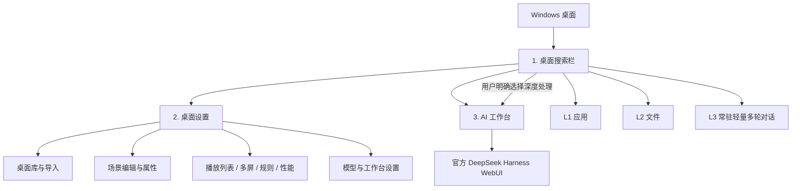
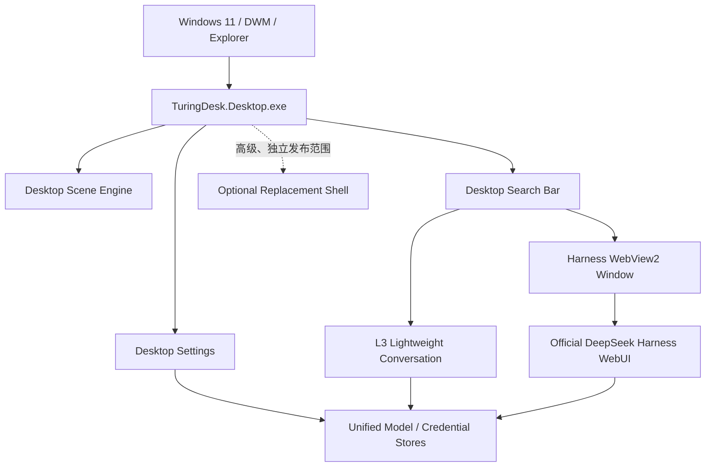

# TuringDesk 产品与系统设计规范

> 状态：**待评审设计基线**  
> 版本：0.1  
> 日期：2026-08-20  
> 审核基线：`afc82e8`  
> 适用对象：产品、设计、桌面端、Runtime、测试、打包与文档维护者

## 1. 文档目的

本文定义 TuringDesk 的长期产品方向、用户界面、功能边界和系统架构，是后续开发的统一设计基线。

它解决的问题不是“下一次提交改什么”，而是：

- TuringDesk 最终是什么产品；
- 用户应该看到哪些界面；
- 搜索、轻量 AI 和深度工作台如何分工；
- 哪些能力属于 TuringDesk，哪些能力交给 DeepSeek Harness；
- 哪些旧路线不得重新进入默认产品；
- 功能完成应当按照什么标准判断。

本文通过评审后即为产品与系统设计的唯一基线。旧产品、架构、UX、Harness/MCP、Shell Surface、Roadmap 和版本执行文档已经移除，不得从历史提交中恢复为并行设计依据。

具体清理步骤见 [AI-WORKBENCH-CONSOLIDATION-PLAN.md](./AI-WORKBENCH-CONSOLIDATION-PLAN.md)。执行计划可以安排顺序，但不能改变本文定义的产品边界。

## 2. 规范语言

- **必须**：发布前不可省略的产品或架构约束。
- **应该**：正常情况下应遵守，偏离时必须记录理由和影响。
- **可以**：允许实现，但不能破坏“必须”和“应该”项。
- **非目标**：当前产品明确不做；不得以临时兼容为理由悄悄恢复。

## 3. 产品定义

TuringDesk 是一个运行在 Windows 上的 **可编程桌面引擎 + AI 工作台入口**。

它包含两个同等重要的支柱：

1. **Wallpaper Engine 级桌面体验**：桌面场景播放、导入、编辑、属性、多屏、播放列表、应用规则与性能控制。
2. **分层 AI 工作流**：在桌面搜索栏中完成应用、文件和轻量多轮对话，需要完整 Agent 能力时进入官方 DeepSeek Harness 工作台。

一句话描述：

> TuringDesk 在保留 Windows 原生桌面兼容性的前提下，把 Wallpaper Engine 式桌面定制、统一搜索和完整 AI 工作台组合成一个常驻桌面产品。

## 4. 核心设计原则

### 4.1 保留 Windows，增强桌面

默认模式必须保留 Explorer。Explorer 继续负责：

- 桌面图标；
- 开始菜单与任务栏；
- 系统托盘；
- 文件右键菜单、Jump List 和 Shell 兼容性；
- 普通 Windows 应用窗口管理。

TuringDesk 默认只负责 Explorer 没有提供的能力：

- 动态桌面场景；
- 桌面场景编辑和自动切换；
- 顶部统一搜索与轻量 AI；
- 官方 DeepSeek Harness 工作台入口。

Replacement Shell 不是默认产品路径，不得影响默认增强模式的设计和发布节奏。

### 4.2 三个主界面

默认产品只允许三个一级用户界面：

1. **桌面搜索栏**；
2. **桌面设置**；
3. **AI 工作台**。

普通用户不应再看到旧 Home 仪表盘、Workspace/Tasks/Memory 页面、AI Orb、Conversation Card、Execution Trace Card 或独立 Runtime 控制面板。

### 4.3 一个深度工作台

官方 DeepSeek Harness WebUI 是唯一的深度 AI 工作台。

TuringDesk 必须复用官方 WebUI，不重新开发第二套完整 Agent 前端，也不维护第二个原生 Agent 内核。

### 4.4 轻重分离

应用搜索、文件搜索和轻量多轮对话必须保持快速、低资源、独立可用。

只有用户明确进入“深度处理”时，才按需启动官方 Harness 工作台。桌面引擎、应用搜索和文件搜索不得依赖 Harness 成功启动。

### 4.5 用户控制优先

TuringDesk 不应在用户只想搜索或聊天时自动打开大型工作台，也不应静默执行 Windows 操作。

升级到深度工作台必须是可见、可撤销、由用户确认的行为。

### 4.6 失败隔离

- 桌面场景失败不能破坏 Explorer。
- AI 模型失败不能破坏应用/文件搜索。
- Harness 失败不能破坏桌面设置。
- WebView2 失败不能让用户失去 Windows 桌面。
- 场景渲染暂停或释放时，搜索栏仍应可用。

## 5. 用户界面信息架构



## 6. 界面一：桌面搜索栏

### 6.1 定位

桌面搜索栏是用户进入 TuringDesk 的第一入口，也是应用、文件、轻量 AI 和深度工作台的统一路由器。

它不是任务栏，不替代 Windows 开始菜单，也不是一个缩小版 Harness。

### 6.2 布局

搜索栏必须位于主显示器顶部居中区域，并处于桌面 Z-order：

- 高于 Explorer 桌面背景和图标层；
- 低于所有普通应用窗口；
- 不能使用全局 always-on-top；
- `Alt+Space` 聚焦后仍应返回桌面层级；
- 桌面图标应该 best-effort 避让搜索栏保留区，失败时不得操作或隐藏 Explorer。

从左到右的固定信息结构：

1. AI 标识和当前轻量模型选择器；
2. 主搜索/对话输入框；
3. 语音入口；
4. 设置入口。

### 6.3 1→2→3→4 分层行为

#### L1：应用

目标：快速查找并启动本机应用。

必须支持：

- Win32 应用；
- 已支持的打包应用；
- 模糊匹配、拼音/名称等现有搜索能力；
- 键盘上下选择和 Enter 启动；
- 使用真实 Windows 应用图标。

应用启动由 TuringDesk 原生搜索服务完成，不通过 AI 或 Harness。

#### L2：文件

目标：快速查找并打开本机文件或文件夹。

必须支持：

- Everything 可用时的快速结果；
- Everything 未连接、正在索引和发生错误时的明确状态；
- 使用 Windows 默认关联方式打开结果；
- 不把文件内容发送给模型，除非用户随后明确进入深度工作台并授权相关范围。

#### L3：常驻轻量多轮对话

目标：不打开完整工作台，快速完成普通问答、写作、解释、翻译、计算和建议。

设计约束：

- 直接使用用户选择的模型接口；
- 在当前桌面会话中保存有限多轮上下文；
- 不启动 Node、旧 Runtime 或 Harness WebUI；
- 没有本机工具权限；
- 不得声称已经操作文件、应用或 Windows；
- 回答、错误、取消和重试都在搜索栏自己的交互层中完成；
- 模型可以建议进入 L4，但不能自动打开 L4。

#### L4：Harness 深度处理

目标：把需要 workspace、skills、jobs、工具执行或复杂多步骤流程的请求交给完整 AI 工作台。

进入方式必须是显式的，例如：

- 用户点击“深度处理”；
- 用户使用约定的深度处理快捷键；
- 用户接受 L3 给出的升级建议。

进入 L4 时必须保留原始问题。若任务交接失败，应保留可复制文本并允许重试，不能静默丢弃请求。

### 6.4 Enter 与深度处理规则

- 有选中的应用或文件结果时，Enter 执行该结果。
- 没有选中结果时，Enter 进入 L3。
- 进入 L4 必须使用独立、明确的操作。
- 网络错误、模型错误和超时不是自动升级 L4 的理由。

### 6.5 语音

语音是搜索栏的输入方式，不是第四个主界面。

语音识别结果应该让用户可见，并进入与键盘输入相同的路由规则。语音不得绕过 L4 的显式确认边界。

## 7. 界面二：桌面设置

### 7.1 定位

桌面设置是 Wallpaper Engine 式桌面管理中心，也是唯一的 TuringDesk 设置入口。

设置按钮不得同时打开多个历史设置窗口。旧 Desktop DIY Center、旧 MainWindow 设置页和分散模型弹窗应逐步合并到同一设置体系。

### 7.2 固定一级栏目

设置页的一级栏目顺序为：

1. **已安装**：桌面库、搜索、预览、应用、导入和导出；
2. **播放列表**：顺序/随机轮换与时间设置；
3. **多屏配置**：每屏、跨屏、镜像和配置快照；
4. **应用规则**：根据程序运行、聚焦或全屏切换场景和播放状态；
5. **性能**：FPS、音量、电源、全屏和资源释放策略；
6. **AI**：模型、Base URL、凭据、连接测试和 AI 工作台入口；
7. **高级/诊断**：版本、commit、日志、WebView/Harness 状态和实验功能。该栏目可以在功能成熟后加入，但不得把普通设置放入高级页。

同一个栏目不得重复出现。测试截图中的两个“多屏配置”不属于目标设计。

### 7.3 桌面项目类型

桌面库目标支持：

- 图片；
- 动图；
- 视频；
- Web（HTML/CSS/JS）；
- Scene（图层、效果、粒子、时间轴、音频响应、视差、Shader 和脚本）。

项目应使用可版本化的场景/包格式。公开场景模型不应与 WPF 强绑定，以便后续更换为 Direct3D、DirectComposition、GPU 视频或其他渲染器。

### 7.4 编辑体验

用户从“已安装”的桌面项目进入编辑，而不是进入独立产品首页。

完整编辑目标包括：

- 图层树；
- 位置、缩放、旋转、透明度和混合模式；
- 图片、视频、文字、Widget 与粒子图层；
- 时间轴和关键帧；
- 鼠标视差；
- 音频响应参数；
- 效果/Shader 栈；
- 脚本钩子；
- 预览、暂停、FPS 和性能信息；
- 导入、导出和另存为。

编辑器可以分阶段实现，但场景格式和运行时边界不能因为早期 UI 简单而封死这些能力。

首个对外版本采用 **效果优先的 Creator Lite**，不承诺完整专业编辑器。具体范围由 [V1-SCENE-RELEASE-SCOPE.md](./V1-SCENE-RELEASE-SCOPE.md) 定义：用户首先必须能稳定应用至少 3 个展示品质的酷炫内置场景；编辑器只承诺基础图层、变换、简单粒子/效果和双关键帧循环动画。完整 Shader 编辑器、节点图和专业多轨时间轴不进入首版发布门槛。

### 7.5 用户属性

每个场景可以声明面向普通用户的属性：

- 颜色；
- 滑块；
- 开关；
- 下拉选择；
- 文本；
- 媒体/纹理替换；
- 快捷动作；
- 属性分组。

属性面板必须根据元数据生成，不能为每个场景硬编码设置页面。

### 7.6 多屏与播放规则

必须支持的目标行为：

- 每个显示器使用不同场景；
- 一个场景跨越多个显示器；
- 克隆/镜像；
- 每屏独立播放列表；
- 保存和恢复显示器配置；
- 显示器插拔和分辨率/DPI 变化后安全恢复；
- 应用启动、聚焦、最大化或全屏时执行 keep、mute、pause、stop 或切换目标。

## 8. 界面三：AI 工作台

### 8.1 定位

AI 工作台是官方 DeepSeek Harness WebUI 的 TuringDesk 原生窗口壳。

TuringDesk 负责：

- 启动和停止官方 Web profile；
- WebView2 原生窗口承载；
- 加载、错误、重试和进程崩溃状态；
- 模型与凭据的统一配置桥接；
- 搜索栏到工作台的任务交接；
- 本地 URL 和窗口安全策略。

DeepSeek Harness 负责：

- 完整会话 UI；
- workspace；
- skills；
- jobs/后台任务；
- Harness 自身支持的工具、状态和高级设置；
- 会话持久化与官方交互行为。

具体能力以项目锁定的官方 `dsh --profile web` 版本实测结果为准，不能使用旧 `turingdesk.cordis.yml` 的配置推断。

### 8.2 唯一内核约束

深度工作台必须只有一个进程路径：

```text
TuringDesk Harness Window
  -> WebView2
    -> official dsh --profile web
```

不得再并行启动：

- TuringDesk 4317 Agent Runtime；
- SDK JSON-RPC Harness；
- 原生 Agent cards/runtime 状态投影；
- 只为兼容旧链路存在的 Cordis profile。

### 8.3 启动与关闭

- TuringDesk 启动时不预热 Harness。
- 用户进入 L4 或从设置打开工作台时按需启动。
- 工作台存在活动窗口或任务时不得被 idle timer 误杀。
- 所有工作台窗口关闭且无活动任务后，可以延迟回收进程。
- 刷新只刷新 WebUI，不应启动另一个 Agent Runtime。
- 端口冲突、进程退出、启动超时和 WebView2 缺失必须有可理解的错误页。

### 8.4 任务交接

搜索栏提交给工作台的最小数据包括：

- 原始用户文本；
- 用户明确选择的工作区（如有）；
- 可选的 L3 对话摘要，但不得未经用户预期传递全部历史；
- 来源标记和创建时间。

优先使用 Harness 官方支持的 URL、会话或消息接口。DOM selector 注入只能作为有版本测试的兼容回退，不能成为唯一协议。

### 8.5 Windows 工具边界

默认工作台不注入旧 TuringDesk Windows MCP，不启动 4318 Capability Server，也不暴露以下旧工具：

- 桌面/窗口快照；
- 白名单 Chrome、VS Code、Terminal 启动；
- 窗口查找、聚焦、移动、缩放和平铺。

这不等于删除 TuringDesk 原生 UI 所需的 `AppLauncher` 或 `WindowManager`。

未来若需要 Windows 自动化，必须作为新的独立能力设计，并满足：

- 用户可见开关；
- 最小权限；
- 工作区/应用范围；
- 执行前确认；
- 可审计记录；
- 失败与撤销策略。

不能直接恢复当前隐式 MCP patch。

## 9. 统一模型与凭据设计

### 9.1 一个设置概念

用户只设置一次提供商、模型、Base URL 和凭据。搜索栏 L3 与官方 Harness 工作台必须读取同一个逻辑配置。

### 9.2 数据职责

- 非敏感模型设置可以保存在 TuringDesk 设置中，并同步到官方 Harness settings store。
- API Key 必须写入官方 Harness 可写 credential store；Windows Credential Manager 可以作为迁移或恢复副本。
- 不得把 API Key 放入命令行参数。
- 不得通过继承环境变量把只读凭据覆盖到官方 WebUI。
- 日志、错误页、诊断页和崩溃报告不得显示完整密钥。

### 9.3 连接测试

连接测试是独立提供商探测，不应启动旧 Agent Runtime，也不应创建持久 Harness 会话。

测试结果至少区分：

- 凭据缺失或无效；
- Base URL 无法连接；
- 模型不存在；
- 服务限流；
- 网络超时；
- 返回格式不兼容。

## 10. 目标系统架构



### 10.1 常驻部分

默认启动后可以常驻：

- Explorer 桌面场景宿主；
- 搜索索引和搜索栏；
- 场景播放规则；
- 可选语音识别；
- 轻量模型配置和有限对话状态。

### 10.2 按需部分

只有用户进入工作台时启动：

- 嵌入式 Node；
- 官方 `dsh --profile web`；
- WebView2 工作台内容进程。

### 10.3 不再存在的默认部分

- 4317 TuringDesk Agent Runtime；
- 4318 Capability Server；
- TuringDesk SDK JSON-RPC Harness；
- TuringDesk-owned Agent Cordis profile；
- 原生 Conversation/Trace/Activity cards；
- 默认注入的 Windows MCP。

## 11. 数据与状态边界

### 11.1 TuringDesk 拥有

- 场景库索引；
- 场景包和用户属性；
- 当前桌面与每屏分配；
- 播放列表；
- 应用规则和性能设置；
- 搜索设置和有限 L3 会话状态；
- 非敏感模型配置；
- UI 布局与首次使用状态。

### 11.2 Harness 拥有

- Harness 会话历史；
- workspace 状态；
- skills/jobs 等官方工作台数据；
- 官方 Harness credential store；
- 官方 WebUI 自身设置。

TuringDesk 不应复制或私自修改 Harness 内部会话格式。跨界同步必须通过稳定、可测试的配置或接口完成。

### 11.3 场景包

场景包必须：

- 有明确格式版本；
- 支持向后兼容或迁移；
- 对外部文件引用做路径约束；
- 不允许通过相对路径逃逸场景根目录；
- 对 Web/脚本场景声明权限和网络策略；
- 导入失败时不污染已安装库。

## 12. 视觉与交互设计

### 12.1 总体风格

目标是“Windows 11 熟悉感 + 轻量桌面增强”，而不是全屏 AI 仪表盘。

- 使用系统字体和清晰的 Windows 窗口行为；
- 以浅色中性背景、蓝色主操作色和适度圆角为默认；
- 不用大量高饱和霓虹装饰干扰桌面内容；
- 普通按钮、选中、禁用、加载、成功和错误状态必须可区分；
- 支持 100%～200% DPI 和多屏不同缩放；
- 键盘导航、焦点状态和文本选择必须可用。

### 12.2 搜索栏

- 视觉上是一条完整、稳定的桌面控件；
- 模型选择器不应抢占主输入区域；
- 搜索结果和对话结果应在需要时展开，空闲时保持紧凑；
- 普通应用窗口覆盖搜索栏时不应出现穿透或抢焦点。

### 12.3 设置页

- 原生可缩放窗口；
- 桌面库使用卡片浏览，右侧显示选中项目的操作与状态；
- 编辑类功能使用清晰的层级和属性面板；
- 禁用操作必须说明原因，不能只显示灰色空按钮；
- 所有修改应区分“立即生效”“保存”“应用到桌面”。

### 12.4 工作台

- TuringDesk 原生壳只提供标题、加载/错误状态、刷新和必要诊断；
- 不重复实现 Harness 导航、会话栏或工具 UI；
- 加载页必须告诉用户正在启动官方 AI 工作台，而不是模糊地写“Runtime”；
- 启动超过合理时间后提供错误详情和重试，不无限显示进度条。

## 13. 性能与可靠性要求

### 13.1 启动

- 搜索栏和静态桌面不等待 AI 或 Node。
- Harness 不在应用启动时预热。
- 场景加载失败时回退到 Windows 原桌面或安全静态场景。

### 13.2 搜索

- 热索引下应用结果应该接近即时反馈。
- 文件提供商较慢时先显示状态，不阻塞应用结果。
- 用户连续输入时取消过期查询和模型请求。

### 13.3 场景

- 支持全局 FPS 限制；
- 全屏/游戏场景支持 keep、pause、stop；
- stop 必须释放重型视频/GPU/Web 资源；
- 多屏拓扑变化不得导致场景窗口覆盖普通应用；
- 视觉渲染故障不能终止搜索栏或设置进程。

### 13.4 工作台

- 只绑定 loopback；
- 启动、空闲回收和应用退出必须结束自己拥有的进程；
- 不结束用户自行启动的其他 Harness 进程；
- 对端口占用和僵尸进程有明确诊断；
- HTTP 200 只能证明服务存活，不能作为工作台功能完成标准。

## 14. 安全与隐私

- 默认增强模式不修改 Windows Shell 注册表。
- Replacement Shell 只能由用户显式启用，并提供 Explorer 恢复入口。
- TuringDesk 不默认获得管理员权限。
- 不向模型默认暴露 PowerShell、Bash、文件删除、安装、关机或任意 Windows 控制。
- 默认官方工作台不注入 TuringDesk Windows MCP。
- L3 最终效果需要接近于cli的能力，但必须在TuringDesk的框架内设计与实现
- WebView 只允许预期的本地工作台来源；外部导航必须显式交给系统浏览器或阻止。
- Web 场景、脚本场景和导入包视为不受信任内容，需要隔离、路径检查和权限策略。
- 用户数据和凭据不进入普通日志。

## 15. 降级体验

| 故障 | 必须保留的能力 | 用户反馈 |
|---|---|---|
| Everything 不可用 | 应用搜索、L3、设置、工作台入口 | 显示文件搜索未连接及恢复建议 |
| 模型/API 不可用 | 应用/文件搜索、桌面设置 | L3 显示分类错误，允许改模型 |
| Harness 启动失败 | 桌面、搜索 L1/L2/L3、设置 | 工作台错误页、日志摘要、重试 |
| WebView2 不可用 | 桌面、搜索、设置 | 提示安装/修复 WebView2，不打开外部不受控页面 |
| 场景渲染失败 | Explorer、搜索、设置、AI | 回退安全桌面并标记失败场景 |
| 多屏拓扑改变 | Explorer 和普通应用 | 重建场景宿主，不覆盖应用窗口 |

## 16. 非目标

以下内容不属于默认产品设计：

- 替换 Windows 内核；
- 默认替换 Explorer；
- 全屏聊天应用；
- 常驻宽侧栏或三栏 AI 仪表盘；
- 旧 MainWindow Home/Apps/Workspace/Tasks/Memory 仪表盘；
- AI Orb 作为主要入口；
- TuringDesk 自研完整 Harness 前端；
- TuringDesk 第二套原生 Agent Runtime；
- 原生 Conversation/Execution Trace 卡片；
- 默认 Windows MCP/Capability Server；
- 只允许启动 Chrome、VS Code、Terminal 的旧 Agent 白名单工具；
- 默认无限制终端、文件或管理员自动化；
- 为了 UI 一致性替换真实 Windows 应用/文件图标；
- 把 CI、安装包生成成功当作用户功能完成。

## 17. Replacement Shell 的产品位置

Replacement Shell 是高级、显式、独立验收的模式，不属于三个主界面的默认路线。

在做出新的产品决策前：

- 可以保留现有 `--shell` 和恢复机制；
- 不得让 shell 专用需求改变默认增强模式架构；
- 不得为 shell 模式保留第二套 Agent 内核；
- shell 中需要深度 AI 时也应打开同一个官方工作台；
- shell 模式的发布状态必须明确标记为实验、冻结或正式支持，不能含糊。

## 18. 关键用户旅程

### 18.1 应用搜索

1. 用户点击搜索栏或按 `Alt+Space`。
2. 输入应用名称。
3. 结果即时显示真实图标和应用名称。
4. 用户选择并按 Enter。
5. Windows 原生应用启动，搜索栏回到桌面层。

### 18.2 文件搜索

1. 用户输入文件名或路径关键词。
2. 应用结果与文件结果清晰区分。
3. 用户选择文件/文件夹。
4. 使用 Windows 默认关联打开。

### 18.3 轻量多轮对话

1. 用户输入普通问题并按 Enter。
2. L3 显示正在回答和取消状态。
3. 回答在搜索栏交互层展开。
4. 用户继续追问，有限上下文延续。
5. 关闭/重置会话后不再携带旧上下文。

### 18.4 深度任务

1. 用户输入需要工作区、技能、后台任务或复杂执行的请求。
2. 用户明确选择“深度处理”。
3. TuringDesk 打开工作台加载页，并按需启动官方 Harness WebUI。
4. 原始请求可靠进入工作台。
5. 用户在官方 WebUI 中管理会话、workspace、skills、jobs 和执行过程。

### 18.5 应用桌面

1. 用户从搜索栏打开设置。
2. 在“已安装”中选择场景或导入新项目。
3. 预览并查看属性。
4. 点击“应用到桌面”。
5. 场景在 Explorer 图标后生效并可在重启后恢复。

### 18.6 编辑桌面

1. 用户在已安装项目中选择“编辑”或“复制并编辑”。
2. 编辑图层、属性、效果或时间轴。
3. 实时预览。
4. 保存为版本化项目。
5. 应用到一个或多个显示器。

## 19. 发布验收门槛

### 19.1 产品结构

- 默认只出现三个主界面。
- 旧 Home、Orb、原生 Agent 卡片和 Runtime UI 无普通入口。
- 设置只有一个入口和一套栏目。

### 19.2 搜索

- L1、L2、L3、L4 路由符合本文规则。
- L3 不启动 Node/Harness。
- L4 只启动官方 WebUI。
- 应用、文件、AI 任一路径故障不拖垮其他路径。

### 19.3 桌面引擎

- 图片、视频、Web 和 Scene 的已承诺类型可真实导入和恢复。
- 多屏、播放列表、用户属性和应用规则达到对应版本承诺。
- 全屏 pause/stop 能真实降低资源使用。
- 编辑器功能以实际可操作结果验收，不能只以按钮或页面存在验收。

### 19.4 AI 工作台

- 只有官方 `dsh --profile web`。
- 会话、workspace、skills、jobs 按锁定版本逐项实测并记录结论。
- 深度任务交接有成功和失败测试。
- 默认无旧 Windows MCP 和 4318 Capability Server。
- 不再打包 4317 Runtime、SDK Cordis profile 和原生 Agent gateway。

### 19.5 发布一致性

- win-x64 与 win-arm64 的支持状态明确。
- 测试包显示版本、commit、架构和构建时间。
- 截图、测试报告和二进制可追溯到同一 commit。
- 安装、升级、修复和卸载不会留下旧 Runtime/MCP 文件或进程。
- README、设计规范、架构说明、执行计划和 BUILD-INFO 不互相矛盾。

## 20. 固定设计决策

| ID | 决策 | 状态 |
|---|---|---|
| TD-D001 | 默认保留 Explorer，使用桌面增强模式 | 固定 |
| TD-D002 | 默认产品只有搜索栏、桌面设置、AI 工作台三个主界面 | 固定 |
| TD-D003 | 搜索栏采用 L1 应用、L2 文件、L3 轻量多轮、L4 Harness 的分层 | 固定 |
| TD-D004 | L3 没有本机工具，不启动 Node/Harness | 固定 |
| TD-D005 | L4 必须由用户显式进入 | 固定 |
| TD-D006 | 官方 `dsh --profile web` 是唯一深度工作台 | 固定 |
| TD-D007 | TuringDesk 不重建完整 Harness UI，不维护第二个 Agent Runtime | 固定 |
| TD-D008 | 默认移除旧 Windows MCP 与 4318 Capability Server | 固定 |
| TD-D009 | 桌面设置是唯一设置中心，承担 Wallpaper Engine 式管理和编辑入口 | 固定 |
| TD-D010 | L3 与 Harness 共享一个逻辑模型/凭据配置 | 固定 |
| TD-D011 | Harness 按需启动，桌面和搜索不依赖 Harness | 固定 |
| TD-D012 | Replacement Shell 是独立高级范围，不决定默认产品架构 | 固定 |
| TD-D013 | 首版 Scene 采用效果优先的 Creator Lite，不承诺完整 Shader/专业时间轴编辑器 | 固定 |

若要修改“固定”决策，必须先修改本文并记录设计变更，不能直接通过代码或任务描述改变。

## 21. 待评审问题

以下问题需要确认，但它们不得改变上面的固定边界：

1. Replacement Shell 下一版本标记为“实验”“冻结”还是继续正式支持？
2. L3 会话在应用重启后是否恢复，还是只在当前桌面会话内存在？建议默认只保留当前会话。
3. L3 升级 L4 时传递“仅当前问题”还是“用户确认后的对话摘要”？建议默认仅当前问题。
4. 锁定的官方 Harness 版本中，workspace、skills、jobs 的实际可用范围是什么？需要功能盘点后记录，不改变官方 WebUI 唯一工作台的决策。
5. win-x64 与 win-arm64 是同时正式发布，还是先选一个主架构？设计要求两者状态必须公开。

## 22. 文档与路线变更规则

为了防止开发路线再次漂移，后续采用以下规则：

1. 新功能开始前，先确认它属于本文哪个界面、用户旅程和固定决策。
2. 如果无法归类，先做设计评审，不直接开始实现。
3. 任务计划只能细化实现顺序，不能增加第四个主界面或第二个 Agent 内核。
4. 代码现状不自动等于设计；历史残留不能因为“仍可运行”变成正式产品能力。
5. 修改固定决策时，必须同时写明：用户问题、备选方案、影响范围、迁移方案、验收变化和回滚方案。
6. 每次发布评审先对照本文，再对照执行计划和测试报告。
7. 发现 README、旧架构文档或路线图冲突时，先标记为过期并修正文档，不允许挑选对当前实现最方便的一份作为依据。

设计依据优先级：

1. 已评审的本文最新版本及其变更记录；
2. 明确声明修改本文决策的已批准 ADR；
3. 当前版本功能规格；
4. 开发执行计划；
5. Roadmap、Issue 和历史文档；
6. 当前代码行为。

## 23. 变更记录

| 版本 | 日期 | 说明 |
|---|---|---|
| 0.1 | 2026-08-20 | 根据现有三个 UI、搜索 1→2→3→4、Wallpaper Engine 目标和官方 Harness WebUI 唯一工作台方向建立首版设计基线 |
| 0.2 | 2026-08-20 | 固定首版 Scene 为效果优先的 Creator Lite，并将完整 Shader/专业时间轴编辑器移出首版范围 |
